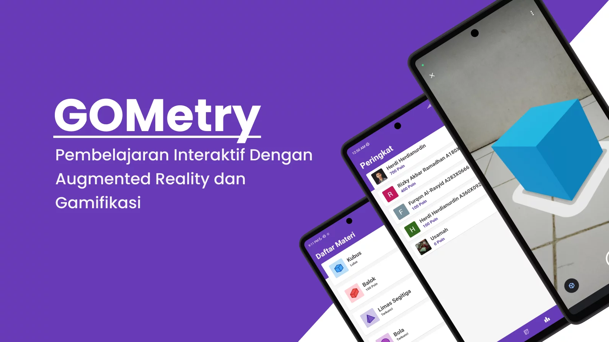

## SIB 2022: Capstone Project Team C22-218



**GOMetry** adalah aplikasi pembelajaran bangun ruang interaktif dengan menggunakan teknologi **Augmented Reality** dan **Konsep Gamifikasi**. Repository ini merupakan salinan dan pembaruan dari repository original proyek akhir tim saya [(GOMetry)](https://github.com/EndKn1ght/gometry).

Berikut adalah daftar pembaruan aplikasi GOMetry:

- Menggunakan design pattern MVVM.
- Perbaikan bug dan issue dari proyek aslinya.
- Pergantian akun firebase.

### Struktur JSON Realtime Database

```JSON
{
  "users": {
    "userId": {
      "achievements": [],
      "displayName": "",
      "email": "",
      "geometries": [],
      "id": "",
      "photoUrl": "",
      "point": 0
    }
  },
  "questions": {
    "questionId": {
      "anwer": "",
      "geometryId": "",
      "image": "",
      "level": "",
      "option": [],
      "question": ""
    }
  }
}
```

### Dibuat Dengan

[](https://www.android.com/)
[](https://kotlinlang.org/)
[](https://firebase.google.com/)
[](https://developers.google.com/ar)

## License

Distributed under the MIT License. See [LICENSE](LICENSE) for more information.
